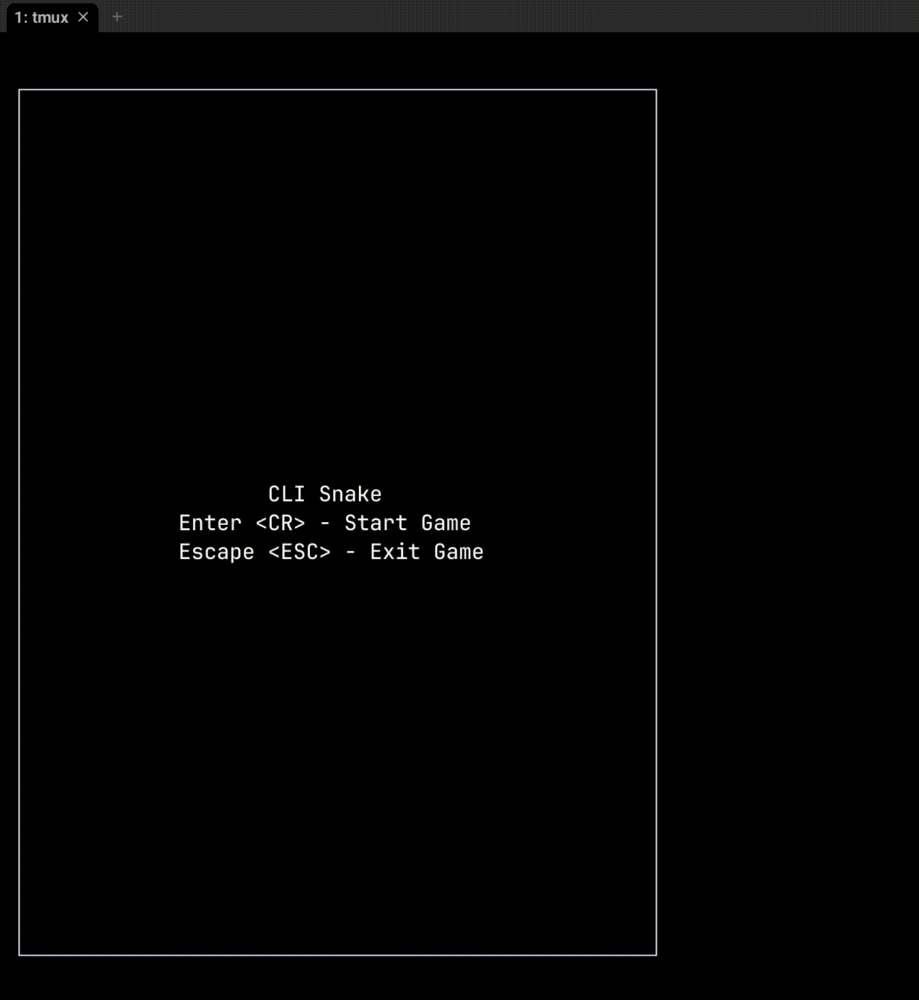

# CLI Snake

A simple snake clone written in Go.



# Installation

## Run from source

1. Clone the repo
2. Run `make tidy`
3. Run `make run`

## Run from binary
Download binary from [https://github.com/Amaquena/cli-snake/releases](https://github.com/Amaquena/cli-snake/releases).
Make sure to add it onto your path and run `clisnake`

## Run using go install
On the terminal run
```
go install github.com/Amaquena/cli-snake@latest
cli-snake
```
